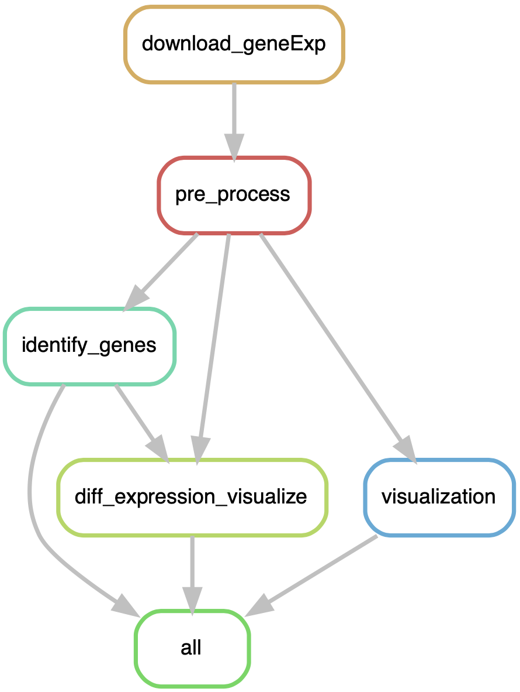

# Identifying genes related to Acute Myeloid Leukemia (AML) in microarray gene expression data

## Background and Rationale
Leukemia is a type of blood cancer usually takes place in the blood-forming tissue (e.g., bone marrow). The disease is characterized by the uncontrolled growth of blood cells, resulting in high numbers of abnormal and not fully developed cells called **blast** or leukemia cells. The exact causes of developing Leukemia are still unknown, but it is believed to be a combination of genetic and environmental factors. Different types of the disease are categorized by the type of white blood cells affected and how quickly the disease grows. In this project, we narrow our study to the most common type, Acute Myeloid Leukemia (AML). AML affects the myeloid cells, which develop into the various types of blood cells, and the word "acute" refers to its rapid progression.

In this project, we designed a pipeline to analyze a microarray gene expression data of AML disease to identify genes in AML patients that are significantly up-regulated or down-regulated (differentially expressed) compared to genes in normal cells. By detecting these genes in AML patients, we would be able to study the pathways that these genes are involved. The data we used is based on [this study](https://pubmed.ncbi.nlm.nih.gov/23836560/) on AML, which is available in NCBI's Gene Expression Omnibus with **GSE48558** GEO accession.

The steps of this pipeline are:
1. Downloading the gene expression data and annotations using ``GEOquery`` package in R
2. Pre-processing (cleaning, log2 transform, median checking) data
3. Differential expression analysis using ``Limma`` package in R
4. Visualization, including Principal Component Analysis (PCA), box-plot of normalized gene expressions, and heatmap correlation of cells
5. Plotting a violin-plot for the query gene of users

<p align="center">
  
</p>

The pipeline is implemented with [snakemake](https://github.com/snakemake/snakemake). The main package dependencies for this pipeline are:
```bash
python v3.6.13
R >= v4.1.1
graphviz v2.40.1
```
Libraries needed for R scripts are downloaded at the beginning of the ``dataset`` script.

### Usage
