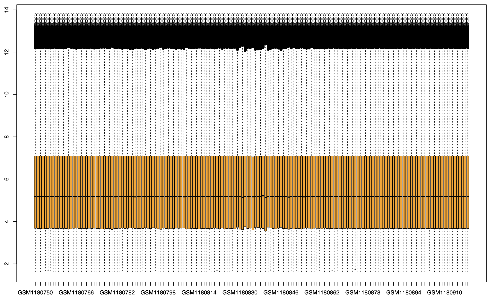
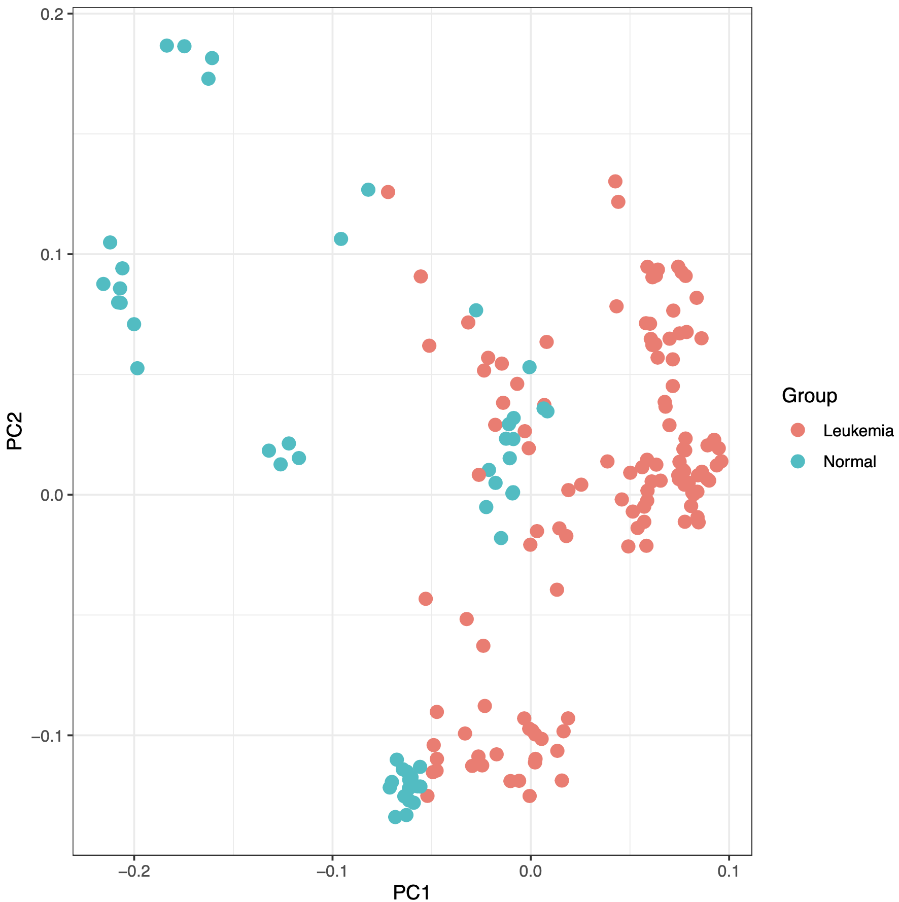
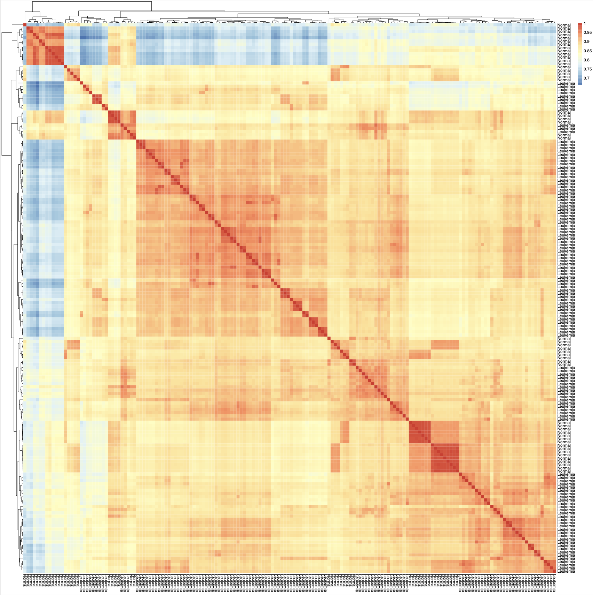
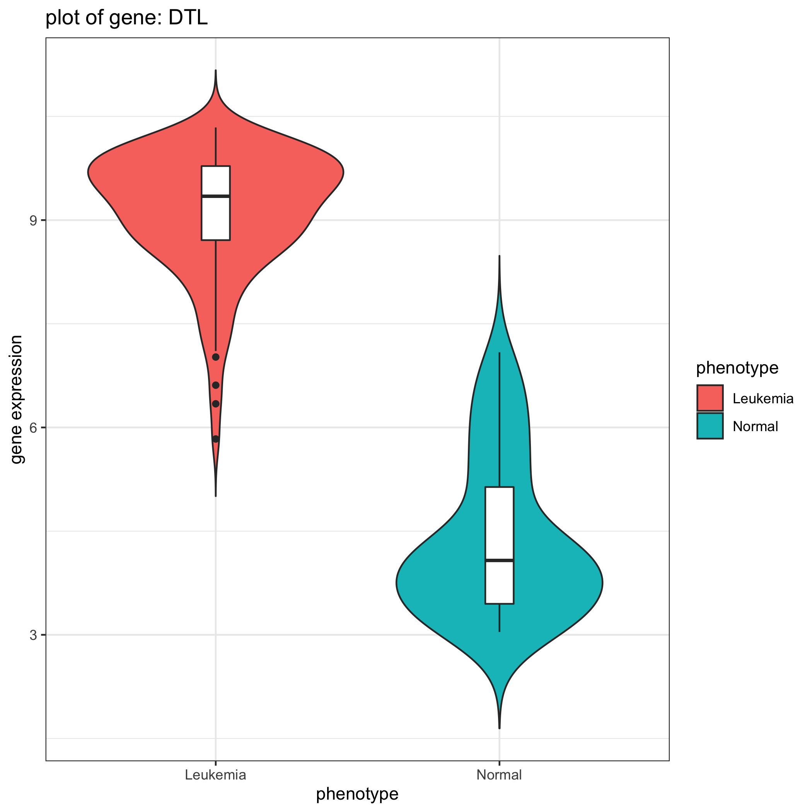

# Identifying genes related to Acute Myeloid Leukemia (AML) in microarray gene expression data

## Background and Rationale
Leukemia is a type of blood cancer usually takes place in the blood-forming tissue (e.g., bone marrow). The disease is characterized by the uncontrolled growth of blood cells, resulting in high numbers of abnormal and not fully developed cells called **blast** or leukemia cells. The exact causes of developing Leukemia are still unknown, but it is believed to be a combination of genetic and environmental factors. Different types of the disease are categorized by the type of white blood cells affected and how quickly the disease grows. In this project, we narrow our study to the most common type, Acute Myeloid Leukemia (AML). AML affects the myeloid cells, which develop into the various types of blood cells, and the word "acute" refers to its rapid progression.

In this project, we designed a pipeline to analyze a microarray gene expression data of AML disease to identify genes in AML patients that are significantly up-regulated or down-regulated (differentially expressed) compared to genes in normal cells. By detecting these genes in AML patients, we would be able to study the pathways that these genes are involved. The data we used is based on [this study](https://pubmed.ncbi.nlm.nih.gov/23836560/) on AML, which is available in NCBI's Gene Expression Omnibus with [**GSE48558**](https://www.ncbi.nlm.nih.gov/geo/query/acc.cgi?acc=GSE48558) GEO accession.

The steps of this pipeline are:
1. Downloading the gene expression data and annotations using ``GEOquery`` package in R
2. Pre-processing (cleaning, log2 transform, median checking) data
3. Differential expression analysis using ``Limma`` package in R
4. Visualization, including Principal Component Analysis (PCA), box-plot of normalized gene expressions, and heatmap correlation of cells
5. Plotting a violin-plot for the query gene of users

<p align="center">
  
</p>

The pipeline is implemented with [snakemake](https://github.com/snakemake/snakemake). The main package dependencies for this pipeline are:
```bash
python v3.6.13
R >= v4.1.1
graphviz v2.40.1
```
Libraries needed for R scripts are downloaded at the beginning of the ``dataset`` script.

### Usage
1. Clone to this repository using the following command in terminal:
```bash
git clone https://github.com/HosseinEbrahimiK/biof501-project.git
```
Then, change you directory to the project file using this command:
```bash
cd biof501-project
```
2. Create a ``conda`` environment with the provided ``.yaml`` file. **Note**: The following commands only work for Unix and MacOs systems. Make sure to have a virtual machine to run these commands in other systems.
```bash
conda env create --file environment.yaml
conda activate biof-proj
```
3. Run the pipeline with ``snakemake`` by executing the following code. You'll need to set the number of cores with the ``--cores`` argument. Usually, 2 - 4 cores would work well on most computers. This will create five output files in the results folder.
```bash
snakemake --cores 4 all
```
During running this command, the pipeline asks you to select a gene to plot the violin plot. You are able to see a list of up-regulated and down-regulated genes in the output ``.txt`` files and choose your gene of interest if it exists in differentially expressed genes.

---
### Input

The input data is automatically downloaded with the ``GEOquery`` package in R. It consists of annotation data and the gene expression matrix, where the rows are cells and columns are genes. After the download, the data will be saved in the data folder in the ``.Rds`` format, named ``GSE48558_series_matrix``. After pre-processing data, including log2 transform, if needed, and median normalization, the data is ready for downstream analysis. Also, note that the pre-processed data will also be available in the data folder under the ``ExpressionSet.Rds`` name.

### Output

The outputs of the workflow can be found under the ``results`` folder. When executing the pipeline, these results will be available after running ``visualization``, ``diff_exprs_analysis``, and ``diff_exprs_violin``. The major outputs and their description of this pipeline are:

* ``boxplot.pdf``: To make sure that the data is normalized and pre-processed. The workflow creates a box plot where the samples are at the x-axis and gene expression level on the y-axis. Users can make sure of pre-process step by seeing if across samples the statistics are equal or not. As you can see from the below figure, the median and the upper and lower quantile of samples are similar.

<p align="center">
  
</p>

* ``PCA.pdf``: The workflow produces a visualization of data in 2d-dimension with the principal component analysis method. This plot allows users to see how data is distributed and see if there is a discrimination boundary by simply applying a linear transformation model. The plot shows that the two types of data points, normal and Leukemia, are somewhat localized in different parts of space. This suggests that some genes have been expressed very differently in these two groups.

<p align="center">
  
</p>

* ``pheatmap.pdf``: Another exploratory data analysis step is to visualize corrections between samples in our dataset. The map shows some clear block structures of correlations between Leukemia samples and quite no correlation between Leukemia and normal cells. Also, sub-blocks in the map are related to sub-type of cells that are present in the data, such as B-cells and T-cells.

<p align="center">
  
</p>

* ``upregulated.txt``: List of genes that statistically significantly up-expressed in Leukemia cells compared to normal cells.

* ``downregulated.txt``: List of genes that statistically significantly down-expressed in Leukemia cells compared to normal cells.

*  ``gene expression violin plot``: Based on the input query from user on gene symbol, the workflow create a violin plot for the given gene showing the difference in expression of it in Leukemia and normal cells.

<p align="center">
  
</p>
